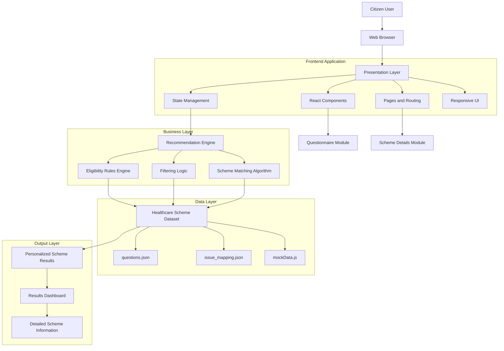
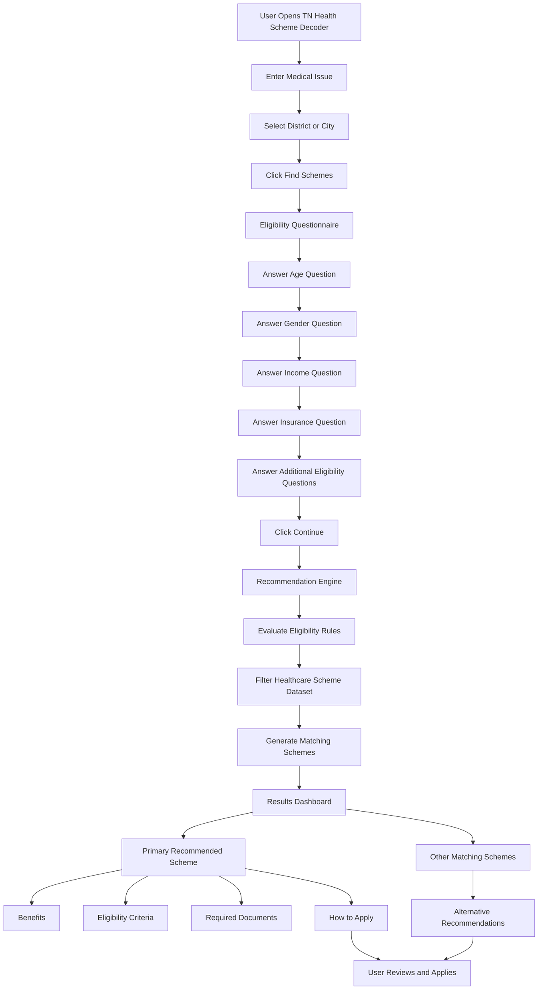

# TN Health Scheme Decoder

## System Architecture

Below is the detailed enterprise-level architecture diagram illustrating the data flow, modules, and core layers of the application.

### Architecture Overview

The application follows a highly scalable, industry-standard layered architecture consisting of the following core layers:

1. **Presentation Layer**
2. **Business Logic Layer**
3. **Data Layer**
4. **Output Layer**

---

### Component Description

#### Presentation Layer
- **React and Vite frontend:** Ensures fast builds and high-performance user interfaces.
- **Responsive user interface:** Adapts seamlessly to various devices and screen sizes.
- **Multi-step questionnaire:** Guides the user through a frictionless data-entry process.
- **Navigation and routing:** Manages seamless transitions between different views in the application.

#### Business Logic Layer
- **Recommendation engine:** Processes user inputs to determine appropriate scheme matches.
- **Eligibility evaluation:** Validates user details against complex scheme criteria.
- **Scheme filtering:** Narrows down the large dataset to only relevant options.
- **Rule-based matching algorithm:** Ensures accurate and reliable scheme recommendations.

#### Data Layer
- **Static JSON datasets:** Acts as a lightweight, fast, and reliable data source.
- **Healthcare scheme metadata:** Stores comprehensive details about the Tamil Nadu health schemes.
- **Question mappings and eligibility criteria:** Houses the logical mappings required for the rules engine.

#### Output Layer
- **Personalized recommendations:** Presents tailored results directly addressing the user's needs.
- **Scheme details page:** Provides an in-depth view of individual schemes, including benefits and application steps.
- **User-friendly results dashboard:** An intuitive summary of all matched healthcare options.

---

### Data Flow

1. User accesses the application via a web browser.
2. User answers the multi-step questionnaire.
3. Responses are sent to the recommendation engine in the Business Logic Layer.
4. Eligibility rules are evaluated.
5. The dataset is filtered within the Data Layer.
6. Matching schemes are generated.
7. Results and detailed scheme information are displayed back to the user via the Output Layer.

---

## User Flow Architecture Diagram

Below is a detailed enterprise-level workflow diagram that clearly explains how a citizen uses the TN Health Scheme Decoder from initial input to final recommendations.

### Detailed User Journey

#### 1. Initial Engagement
- **User opens the application:** The user arrives at the TN Health Scheme Decoder landing page.
- **User enters their medical issue:** The user inputs their specific healthcare need or condition.
- **User selects their district/city:** The user specifies their location to ensure geographically relevant scheme suggestions.
- **User clicks "Find Schemes":** This triggers the initial search and transitions the user to the detailed assessment.

#### 2. Eligibility Evaluation
- **The application displays an eligibility questionnaire:** A multi-step form appears to collect necessary background information.
- **User answers eligibility questions:** The user provides specific details crucial for accurate matching, such as:
  - Age
  - Gender
  - Income category
  - Insurance status
  - Other scheme-specific questions
- **User clicks Continue:** The completed profile is submitted for evaluation.

#### 3. Processing & System Evaluation
- **The Recommendation Engine processes the responses:** The core logic module takes the user's inputs.
- **The system evaluates eligibility criteria:** The rules engine runs complex evaluations against all known parameters.
- **The Healthcare Scheme Dataset is filtered:** Ineligible schemes are discarded from the dataset in real-time.
- **Matching schemes are generated:** A curated list of valid healthcare schemes is produced.

#### 4. Results & Application
- **The Results Dashboard is displayed:** The user is presented with an intuitive summary of their matched options.
- **The user can view:**
  - **Primary recommended scheme:** The most highly relevant match for their situation.
  - **Other matching schemes:** Secondary or supplementary scheme options.
  - **Benefits:** The financial and medical coverage provided by each scheme.
  - **Eligibility criteria:** A transparent breakdown of why they qualified.
  - **Required documents:** A comprehensive checklist of paperwork needed.
  - **How to apply:** Step-by-step instructions on the enrollment process.
- **User reviews and applies:** The user reviews their personalized recommendations and takes actionable steps to apply for their chosen scheme.
