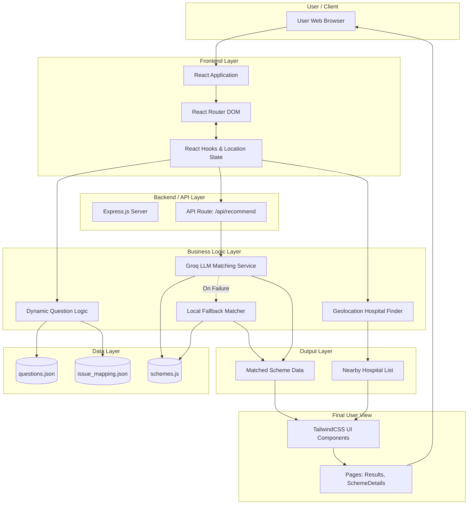
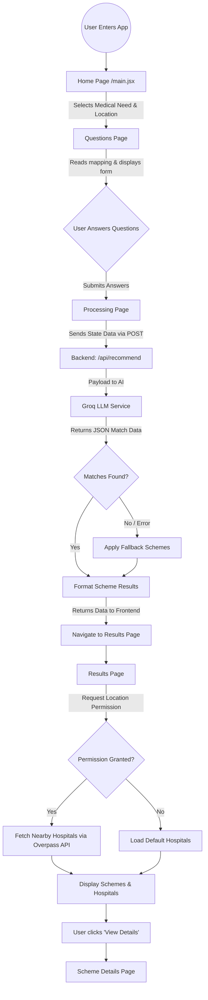

# 1. SYSTEM ARCHITECTURE DIAGRAM

---

# 2. SYSTEM ARCHITECTURE EXPLANATION

*   **User / Client**: This is where the user interacts with the system using their web browser. It acts as the entry point for all interactions.
*   **Frontend Layer**: Built using React and Vite. It uses `React Router DOM` for navigating between different pages (Home, Questions, Processing, Results). Data is passed between these pages using React Router's location state and managed locally via React hooks (`useState`, `useEffect`).
*   **Backend / API Layer**: A Node.js and Express server that handles incoming requests from the frontend. The main endpoint is `POST /api/recommend`, which securely handles the data processing away from the client.
*   **Business Logic Layer**: This layer contains the core processing rules.
    *   **Question Logic**: Determines which questions to show based on the user's initial input.
    *   **Groq LLM Service**: Formats the user's profile and sends it to the Groq API (LLaMA model) to intelligently match them with the best schemes.
    *   **Fallback Matcher**: A safety mechanism that provides default scheme recommendations if the LLM service fails.
    *   **Geolocation Hospital Finder**: Calculates distances and uses the Overpass API to find hospitals near the user's coordinates.
*   **Data Layer**: Contains static JSON and JS files storing the actual content: available government healthcare schemes (`schemes.js`), questionnaire data (`questions.json`), and rules mapping medical needs to categories (`issue_mapping.json`).
*   **Output Layer**: Represents the structured data (matched schemes with percentages, and an array of nearby hospitals) prepared for the user interface.
*   **Final User View**: The rendered UI built with TailwindCSS components (like `Results.jsx`). It takes the data from the output layer and displays it beautifully to the user on their screen.

---

# 3. WORKFLOW ARCHITECTURE DIAGRAM

---

# 4. WORKFLOW EXPLANATION

*   **Entry Flow**: The user starts at the entry point (`main.jsx` -> `App.jsx`) and lands on the `Home` page. Here, they select their basic medical need and location.
*   **Questionnaire Flow**: The user is routed to the `Questions` page. The app reads `issue_mapping.json` to find the correct category for their medical need, then pulls the relevant questions from `questions.json`. The user answers these dynamically rendered questions, and their answers are saved in the local state.
*   **Data Processing Flow**: Once the user submits their answers, they are taken to the `Processing` page. This page acts as a loading screen while it makes a `POST` request to the backend API (`/api/recommend`), sending the user's answers, medical need, and category.
*   **Recommendation Flow**: The backend Express server receives the request and calls the `groqService.js`. This service sends the user's data and all available schemes to the Groq LLM API. The LLM analyzes the data and returns the best matching schemes as JSON. If the LLM call fails or returns empty data, the backend uses a local fallback logic to ensure the user still receives recommendations.
*   **Result Display Flow**: The backend sends the final matched schemes back to the `Processing` page. The app then navigates to the `Results` page, passing the scheme data via router state.
*   **Hospital Lookup Flow**: On the `Results` page, the user is prompted for location access. If granted, the app uses the browser's geolocation and calls the Overpass API to find actual hospitals within a 10km radius, sorting them by distance.
*   **Final Delivery**: The `Results` page renders the matched schemes, match percentages, reasons for eligibility, and the list of nearby hospitals. The user can click on any scheme to view more details on the `SchemeDetails` page.
