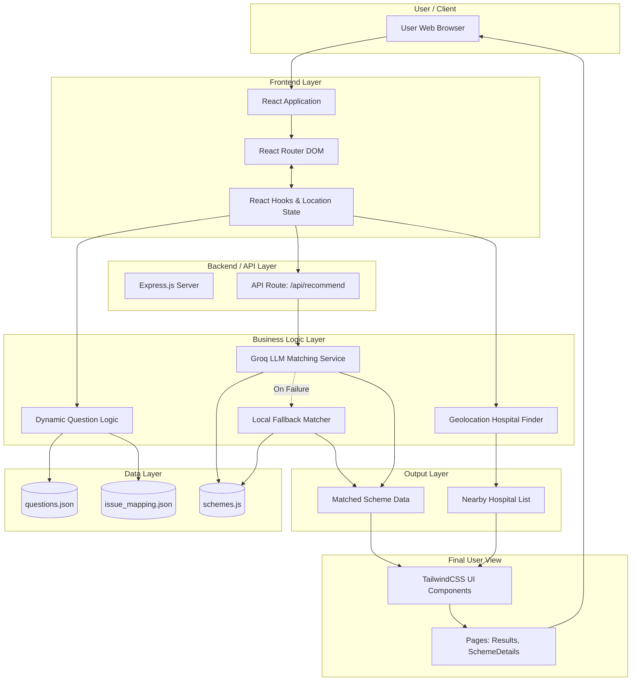
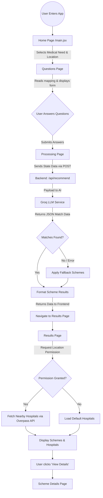

# 1. SYSTEM ARCHITECTURE DIAGRAM

---

# 2. SYSTEM ARCHITECTURE EXPLANATION

### User / Client Layer
- The user accesses the application through a web browser.
- All interactions begin from this layer.

### Frontend Layer
- Built using React and Vite.
- React Router handles navigation between pages.
- React Hooks and Router State manage user data during navigation.

### Backend / API Layer
- Express.js provides the `/api/recommend` endpoint.
- Receives user responses from the frontend and processes recommendation requests.

### Business Logic Layer
- **Dynamic Question Logic:** Displays questions based on the selected medical issue.
- **Groq LLM Service:** Uses AI to match users with the most suitable healthcare schemes.
- **Fallback Matcher:** Generates recommendations when the AI service is unavailable.
- **Hospital Finder:** Finds nearby hospitals using geolocation and the Overpass API.

### Data Layer
- `schemes.js` stores healthcare scheme information.
- `questions.json` contains questionnaire data.
- `issue_mapping.json` maps medical issues to categories.

### Output Layer
- Produces recommended schemes and nearby hospital data.
- Sends processed data to the user interface.

### Final User View
- TailwindCSS components display results and scheme details.
- Users can view recommendations and explore individual scheme information.

---

# 3. WORKFLOW ARCHITECTURE DIAGRAM

---

# 4. WORKFLOW EXPLANATION

1. **Application Entry**
   - The user opens the application and lands on the Home page.

2. **Questionnaire Stage**
   - The user selects a medical need and answers dynamically generated questions.
   - Questions are loaded from `questions.json` and `issue_mapping.json`.

3. **Data Submission**
   - The user's responses are sent to the backend through the `/api/recommend` API.

4. **Recommendation Processing**
   - The backend sends the data to the Groq LLM service.
   - If the AI service fails, the fallback matcher generates recommendations.

5. **Results Generation**
   - The backend returns the matched healthcare schemes to the frontend.

6. **Hospital Lookup**
   - The application requests location access.
   - If permission is granted, nearby hospitals are fetched using the Overpass API.
   - Otherwise, default hospital data is displayed.

7. **Final Display**
   - The Results page shows:
     - Recommended schemes
     - Match percentages
     - Eligibility reasons
     - Nearby hospitals

8. **Detailed Information**
   - Users can open the Scheme Details page to view complete information about a selected scheme.
