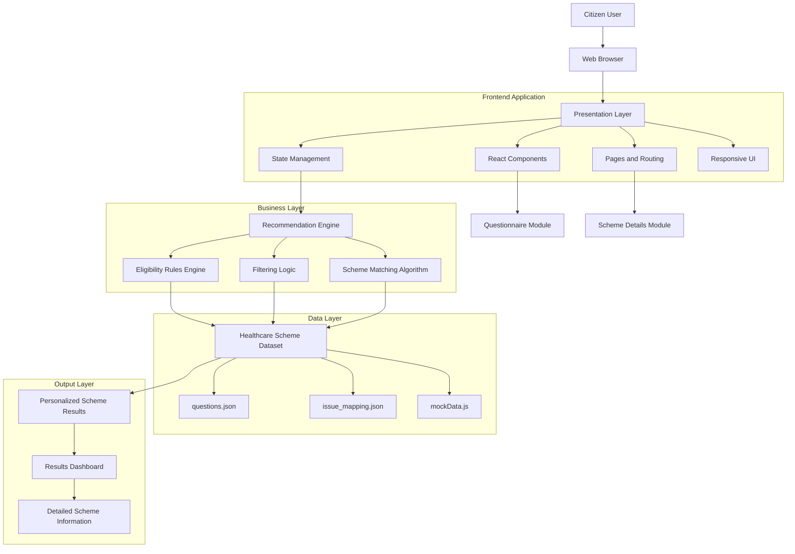

# TN Health Scheme Decoder

## System Architecture

Below is the detailed enterprise-level architecture diagram illustrating the data flow, modules, and core layers of the application.

### Architecture Overview

The application follows a highly scalable, industry-standard layered architecture consisting of the following core layers:

1. **Presentation Layer**
2. **Business Logic Layer**
3. **Data Layer**
4. **Output Layer**

---

### Component Description

#### Presentation Layer
- **React and Vite frontend:** Ensures fast builds and high-performance user interfaces.
- **Responsive user interface:** Adapts seamlessly to various devices and screen sizes.
- **Multi-step questionnaire:** Guides the user through a frictionless data-entry process.
- **Navigation and routing:** Manages seamless transitions between different views in the application.

#### Business Logic Layer
- **Recommendation engine:** Processes user inputs to determine appropriate scheme matches.
- **Eligibility evaluation:** Validates user details against complex scheme criteria.
- **Scheme filtering:** Narrows down the large dataset to only relevant options.
- **Rule-based matching algorithm:** Ensures accurate and reliable scheme recommendations.

#### Data Layer
- **Static JSON datasets:** Acts as a lightweight, fast, and reliable data source.
- **Healthcare scheme metadata:** Stores comprehensive details about the Tamil Nadu health schemes.
- **Question mappings and eligibility criteria:** Houses the logical mappings required for the rules engine.

#### Output Layer
- **Personalized recommendations:** Presents tailored results directly addressing the user's needs.
- **Scheme details page:** Provides an in-depth view of individual schemes, including benefits and application steps.
- **User-friendly results dashboard:** An intuitive summary of all matched healthcare options.

---

### Data Flow

1. User accesses the application via a web browser.
2. User answers the multi-step questionnaire.
3. Responses are sent to the recommendation engine in the Business Logic Layer.
4. Eligibility rules are evaluated.
5. The dataset is filtered within the Data Layer.
6. Matching schemes are generated.
7. Results and detailed scheme information are displayed back to the user via the Output Layer.
