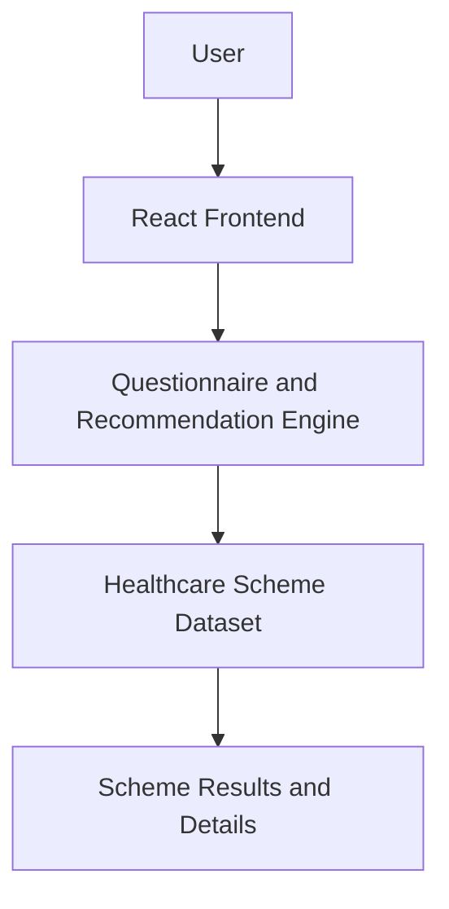

# TN Health Scheme Decoder

## System Architecture Diagram

Below is the high-level architecture diagram illustrating the data flow and core components of the application.

### Component Breakdown
- **React Frontend**: The primary user interface, built with React, Vite for fast bundling, and Tailwind CSS for utility-first styling.
- **Questionnaire & Recommendation Engine**: The core logic module that collects user inputs and maps them against eligibility criteria.
- **Healthcare Scheme Dataset**: A structured JSON dataset containing the comprehensive list of Tamil Nadu healthcare schemes and their specific rules.
- **Scheme Results & Details**: The output module rendering personalized scheme recommendations and detailed informational views for the user.
